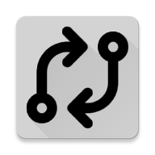
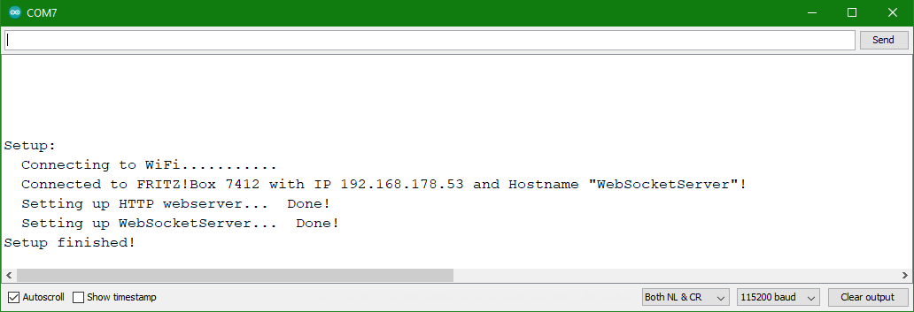
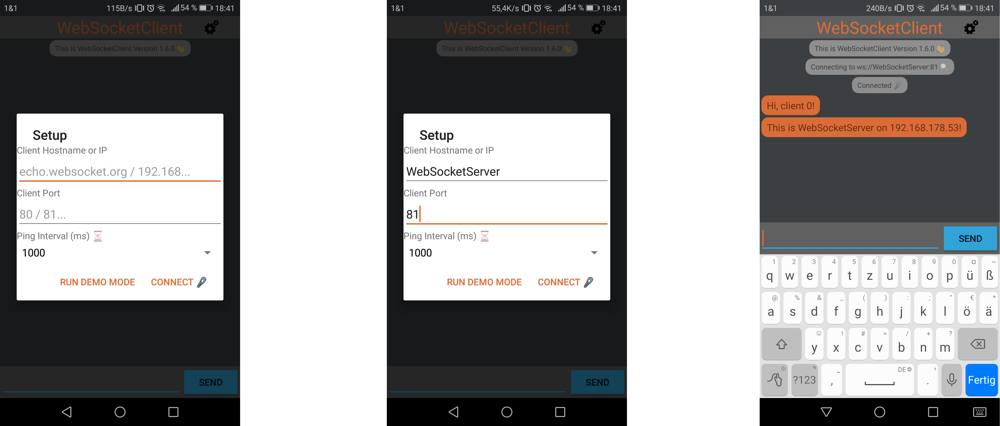

# WebSocketTest </img>

<h1>The project...</h1>

<h3>How does it work?</h3>

The ESP8266 will try to connect to your WiFi network, set up a hostname to be discoverable and finally run an HTTP server on port 80 and a WebSocket server (which sends every message it recieves back to the client the message came from) on port 81. After starting the app, you can connect to the ESP by using the hostname and port (those are "WebSocketServer" and 81 by default) and have some fun while messing around with the system.

<h3>Is there any purpose?</h3>

I built this as a "base" for my upcoming apps where I will be using WebSockets. I am planning to reuse the android as well as the arduino code to save some time. In addition, I implemented the Chat-UI that will allow me to test my upcoming functional WebScoket servers.

<h1>The hardware...</h1>

I developed and tested the code on a NodeMCU and on two Huawei phones running on API Level 24 and 28, but it should theoretically work on all MCUs with ESP8266 chips, on ESP32 chips with some minor changes and on all Android Phones with API level > 24.

<h1>How to use it?</h1>

After adding your WiFi SSID and password (you might also have to change LEDPIN according to your hardware), you can just upload this code on your esp8266 using the Arduino IDE. You might have to install the "WebSockets" library (ver. 2.3.5 worked fine with my code) using the library manager. If this is your first project using the ESP8266, you'll have to <a href="https://github.com/esp8266/Arduino#installing-with-boards-manager">add the esp8266 boards to your manager</a> and install the esp8266 boards library (vers. 3.0.1 works) to upload your code. The LED will light up while the controller is setting everything up. Once the LED is off again, your WebSocket server is ready to go. You can either install the <a href="https://github.com/DeeBuggerTech/002_WebSocket_Test/blob/main/WebSocketClient/compiled_apk/">compiled version</a> of the app or compile it by yourself using android studio. Since I'm not in this play store stuff by now, you will have to accept installing apps from unknown sources when using the compiled version. Make sure that both the phone and the ESP are connected to <b>the same WiFi network</b>. Then open the serial monitor of the port your ESP is connected to and it should look like this. 

</img>

Here we got the local IP and the Hostname (which can be changed <a href="https://github.com/DeeBuggerTech/002_WebSocket_Test/blob/724cdebb90a566ab19e58efe5f2acf0392d58035/WebSocketServer/WebSocketServer.ino#L9">here</a>). You can enter the URL in your browser to check if it's working. If you get a response like "Looks like everything's running smoothly.", you can continue by setting up the app.

</img>

Open the app, enter the URL (or the IP) and the port and hit the connect button. In addition to that, you can change the ping frequency (the NodeMCU onboard LED will flash when receiving a ping / sending a pong). Now you can send some messages and have a beautiful monologue.

<h1>Changelog</h1>

<h3>Android</h3>

<b>Version 1.6.0: </b>
  <ul>
   <li>You can access the connection settings by clicking the gear symbol in the upper right corner. </li>
   <li>The application was modified and tested to work with secure WebSockets. Just add "wss://" to a wss server hostname in order to check it out.</li>
</ul>

<b>Version 1.6.4: </b>
  <ul>
   <li>Bugfix: Messages are no longer lost when the device is rotated.</li>
</ul>

<h1>License</h1>

MIT License  
Copyright (c) 2021 Dee Bugger  
Icon Copyright (c) 2021 icons-icons.com (<a href="https://icon-icons.com/de/symbol/exchange/151372" target="_blank">Exchange Free Symbol</a>) 
Permission is hereby granted, free of charge, to any person obtaining a copy of this software and associated documentation files (the "Software"), to deal in the Software without restriction, including without limitation the rights to use, copy, modify, merge, publish, distribute, sublicense, and/or sell copies of the Software, and to permit persons to whom the Software is furnished to do so, subject to the following conditions:   
The above copyright notice and this permission notice shall be included in all copies or substantial portions of the Software.   
THE SOFTWARE IS PROVIDED "AS IS", WITHOUT WARRANTY OF ANY KIND, EXPRESS OR IMPLIED, INCLUDING BUT NOT LIMITED TO THE WARRANTIES OF MERCHANTABILITY, FITNESS FOR A PARTICULAR PURPOSE AND NONINFRINGEMENT. IN NO EVENT SHALL THE AUTHORS OR COPYRIGHT HOLDERS BE LIABLE FOR ANY CLAIM, DAMAGES OR OTHER LIABILITY, WHETHER IN AN ACTION OF CONTRACT, TORT OR OTHERWISE, ARISING FROM, OUT OF OR IN CONNECTION WITH THE SOFTWARE OR THE USE OR OTHER DEALINGS IN THE SOFTWARE.

